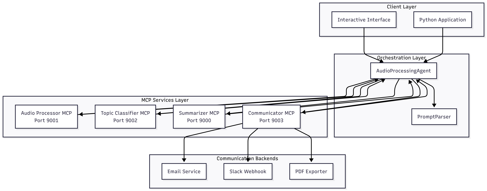

# Sum-It-Up Agent

[](https://python.org) [](https://python-poetry.org) [](https://pytorch.org) [](https://fastmcp.com) [](LICENSE)
Agentic meeting intelligence built on the **Model Context Protocol (MCP)**: ingest audio/video → (optional) diarize → transcribe → classify → summarize → deliver.

---

## Table of Contents

- [Introduction](#introduction)
- [Why Sum-It-Up Agent?](#why-sum-it-up-agent)
- [Quick Start](#quick-start)
- [How It Works](#how-it-works)
- [MCP Architecture](#mcp-architecture)
- [Core Capabilities](#core-capabilities)
- [Prompt Customization](#prompt-customization)
- [Programmatic Usage](#programmatic-usage)
- [PromptParser Evaluation Harness](#promptparser-evaluation-harness)
- [Development](#development)
- [Roadmap](#roadmap)
- [Contributing](#contributing)
- [License](#license)
- [Contact](#contact)

---

## Introduction

**Sum-It-Up Agent** is a modular, MCP-native system for turning meeting recordings into structured outputs (summaries, key points, decisions, action items) and delivering them through communication channels.

The project is designed around **independent services** with clear boundaries, so you can evolve transcription, classification, summarization, and delivery without coupling everything into one monolith.

---

## Why Sum-It-Up Agent?

1. **MCP-first modularity**: each major capability is an MCP server you can swap or extend independently.
2. **Agentic orchestration**: LLM-based intent parsing + dynamic planning to decide what to run and how to format output.
3. **Document-as-implementation prompts**: prompts live as editable `.txt` files and load at runtime—no code edits needed.
4. **Multi-provider LLM support**: use hosted models or local inference depending on cost/latency/privacy constraints.
5. **Operational separation**: environment isolation per server and an app-level lifecycle manager (start/health-check/stop).
6. **Built-in evaluation for intent parsing**: benchmark accuracy + latency across models and prompt variants.

---

## Quick Start

### 1) Install

```bash
git clone https://github.com/iosifidisvasileios/sum-it-up-agent.git
cd sum-it-up-agent
poetry install
```

### 2) Configure environment

```bash
cp .env.example .env
# edit .env with API keys and MCP server settings
```

**Key environment variables:**
- `SLACK_WEBHOOK_URL`: Slack incoming webhook URL for message delivery
- `SENDER_EMAIL_ACCOUNT`: Email account for sending summaries
- `SENDER_EMAIL_PASSWORD`: Email password or app password
- `SUM_IT_UP_LLM_MODEL`: LLM model for intent parsing
- MCP server URLs and ports (pre-configured)

### 3) Run (interactive mode)

```bash
python -m src.sum_it_up_agent
```

Or run a single command:

```bash
python -m src.sum_it_up_agent.app /path/to/audio.mp4 "summarize this meeting and email it to user@example.com and send to slack"
```

---

## How It Works

At runtime, the agent performs a pipeline like:

1. **Ingest & normalize** audio/video
2. **Speaker diarization** for speaker separation
3. **Transcription** (Whisper-family models)
4. **Meeting-type classification** (zero-shot / ensembles)
5. **Instruction-aware summarization** using meeting templates + user instructions
5. **Delivery** via communicator (email, Slack, PDF export; other channels can be added)

Outputs can be saved as structured artifacts (e.g., JSON) for downstream workflows.

---

## System Architecture



```
Sum-It-Up App (Singleton)
├── Audio Processing Agent (Orchestrator)
│   ├── Audio Processor MCP Server (Port 9001)
│   ├── Topic Classification MCP Server (Port 9002)
│   ├── Summarizer MCP Server (Port 9000)
│   └── Communicator MCP Server (Port 9003)
└── Interactive Interface & Server Management
```

### Architecture highlights

- **Single lifecycle manager**: the app starts/stops all servers and validates readiness with health checks.
- **Environment scoping**: each server receives only the environment it needs.
- **Replaceable components**: each server is a clean integration boundary (e.g., swap diarization, change summarizer backend).
- **Scale by service**: scale or optimize transcription independently from summarization or delivery.

---

## Core Capabilities

### Audio processing
- Multi-format input (MP3, MP4, WAV, M4A, FLAC, …)
- Optional speaker diarization
- High-quality transcription with Whisper models

### Topic classification
- Meeting type detection using ensemble methods
- Confidence scoring / uncertainty-aware output
- Support for common meeting classes (planning, retro, interview, support call, etc.)

### Summarization
- File-backed prompt templates for meeting-specific structure
- Multiple summary types (standard, action items, decisions, key points, executive, …)
- Multi-provider backends (hosted and local)
- Output formats: JSON (and extensible)

### Communication
- **Email delivery** with HTML-formatted summaries
- **Slack integration** via webhook URLs with professional formatting
- **PDF export** for archival and sharing
- **Extensible design** for adding new channels (Discord, Teams, etc.)

### Agent features
- LLM-based prompt parsing (turn “what I want” into a structured intent)
- Dynamic planning based on requested outputs and constraints
- Detailed error reporting and graceful degradation

---

## Prompt Customization

All prompts are versioned plain text files following our [ADR: Store prompts as versioned text files](ADR/store-prompts-as-versioned-text-files.md). This approach enables prompt iteration without code changes and supports evaluation workflows.

```
src/sum_it_up_agent/templates/prompt_files/
├── meeting/
│   ├── team_status_sync_standup.txt
│   ├── planning_coordination_meeting.txt
│   ├── decision_making_meeting.txt
│   ├── brainstorming_session.txt
│   ├── retrospective_postmortem.txt
│   ├── training_onboarding.txt
│   ├── interview.txt
│   ├── customer_call_sales_demo.txt
│   ├── support_incident_call.txt
│   └── other.txt
└── system/
    ├── intent_extraction.txt
    └── structured_json_assistant.txt
```

### Versioning Strategy

Prompts are versioned using file naming conventions:
- **Baseline versions**: `v1.txt`, `v2.txt`, etc.
- **Evaluation variants**: `baseline.txt`, `candidate.txt`
- **Experimental versions**: `experimental_*.txt`

### Prompt Categories

**Meeting templates** - Context-specific prompts for different meeting types:
- `team_status_sync_standup.txt` - Daily standups and status updates
- `planning_coordination_meeting.txt` - Sprint planning and coordination
- `decision_making_meeting.txt` - Decision-focused meetings
- `brainstorming_session.txt` - Creative and ideation sessions
- `retrospective_postmortem.txt` - Retrospectives and post-mortems
- `training_onboarding.txt` - Training and onboarding sessions
- `interview.txt` - Interview recordings
- `customer_call_sales_demo.txt` - Customer calls and sales demos
- `support_incident_call.txt` - Support and incident calls
- `other.txt` - Generic meeting fallback

**System prompts** - Core orchestration prompts:
- `intent_extraction.txt` - LLM-based user intent parsing
- `structured_json_assistant.txt` - Structured output formatting guidance

### Runtime Loading

Prompts are loaded at runtime via packaged resources, enabling:
- **Hot-swapping** prompt versions without code deployment
- **A/B testing** different prompt variants
- **Evaluation harness** can specify exact prompt versions for reproducible results
- **Rollback** to previous prompt versions via git

### Evaluation Support

The evaluation framework can pin specific prompt versions for reproducible benchmarking:
```bash
# Run evaluation with baseline prompts
PROMPT_VERSION=baseline python -m unittest test_prompt_parser_eval.py

# Run evaluation with candidate prompts  
PROMPT_VERSION=candidate python -m unittest test_prompt_parser_eval.py
```

---

## Programmatic Usage

```python
import asyncio
from sum_it_up_agent.agent import AudioProcessingAgent, AgentConfig

async def process_meeting():
    config = AgentConfig()

    async with AudioProcessingAgent(config) as agent:
        result = await agent.process_request(
            "meeting.mp3",
            "Please summarize and send action points to john@example.com and also post to Slack"
        )

        if result.success:
            print(f"Summary saved to: {result.summary_file}")
            print(f"Communication results: {result.communication_results}")
        else:
            print(f"Failed: {result.error_message}")

asyncio.run(process_meeting())
```

---

## PromptParser Evaluation Harness

The repository includes a benchmarking harness to evaluate `PromptParser` quality and latency across models and prompt variants.

### What it measures
- Dataset-driven correctness for parsed intent fields (channels, summary types, recipients, custom instructions)
- Enum validation against `CommunicationChannel` and `SummaryType`
- Latency aggregates (avg / p50 / p95)
- Optional cold-start “fair latency” mode for more realistic local-model benchmarking

### Run
```bash
python -m unittest -v tests.test_prompt_parser_eval
```

### Environment controls
```bash
PROMPT_EVAL_MODELS="modelA,modelB"
PROMPT_EVAL_SYSTEM_PROMPTS="default,strict_json"
PROMPT_EVAL_FAIR_LATENCY=1
PROMPT_EVAL_COOLDOWN_MS=500
PROMPT_EVAL_REPORT_PATH=prompt_parser_eval_report.md
```

### MLflow Advanced Evaluation Framework

For comprehensive experimentation and tracking, use the MLflow-based evaluation system in `tests/evaluation_framework/`.

#### Features
- **Multi-model comparison**: Test multiple LLM models against the same dataset
- **Prompt variant testing**: Compare different system prompts side-by-side
- **Experiment tracking**: Full MLflow integration with metrics, parameters, and artifacts
- **Performance analysis**: Detailed latency metrics (avg, p50, p95) and pass rates
- **Visual analytics**: MLflow UI for interactive result exploration
- **Reproducible runs**: Exact model and prompt version tracking

#### Setup
```bash
# Install MLflow dependencies
pip install mlflow pandas

# Start MLflow server (optional, for UI)
mlflow server --host 0.0.0.0 --port 5000
```

#### Usage Examples

**Basic evaluation:**
```bash
cd tests/evaluation_framework
python mlflow_prompt_eval.py
```

**Advanced comparison:**
```bash
python mlflow_prompt_eval.py \
  --models "hf.co/unsloth/Mistral-Small-3.2-24B-Instruct-2506-GGUF:Q3_K_XL" \
           "hf.co/unsloth/Phi-4-mini-reasoning-GGUF:BF16" \
  --system-prompts "default" "strict_json" "conversational" \
  --experiment-name "prompt_optimization_study"
```

**Compare existing runs:**
```bash
python mlflow_prompt_eval.py --compare-only
```

#### Available System Prompts
- `default` - Comprehensive expert prompt with detailed instructions
- `strict_json` - Minimal prompt focused on exact JSON output
- `conversational` - Friendly, natural language prompt
- `step_by_step` - Analytical, step-by-step approach
- `minimal_1`, `minimal_2`, `minimal_3` - Various minimal prompt variations

#### Metrics Tracked
- **Performance**: Pass rate, total cases, passed/failed counts
- **Latency**: Average, p50, p95 response times
- **Detailed results**: Per-case status, failure reasons, actual vs expected outputs
- **Artifacts**: System prompts, CSV results, failure analysis, summary reports

#### Programmatic Usage
```python
from tests.evaluation_framework.mlflow_prompt_eval import MlflowPromptEvaluator, ExperimentConfig

config = ExperimentConfig(
    experiment_name="custom_study",
    models=["your-model-name"],
    system_prompt_keys=["default", "strict_json"],
    fair_latency=True,
    cooldown_ms=100
)

evaluator = MlflowPromptEvaluator(config)
results = evaluator.run_experiment()
```

#### Integration with Versioned Prompts

The MLflow evaluator works seamlessly with the versioned prompt system:
- Automatically logs prompt versions used in each run
- Supports A/B testing of different prompt variants
- Enables reproducible research with exact prompt tracking
- Integrates with the ADR-based prompt management approach

For detailed documentation, see `tests/evaluation_framework/README-mlflow-eval.md`.

---

## Development

### Repo Layout

```
sum-it-up-agent/
├── src/
│   └── sum_it_up_agent/
│       ├── agent/
│       ├── audio_processor/
│       ├── topic_classification/
│       ├── summarizer/
│       ├── templates/
│       └── communicator/
└── tests/                      # Test suite and examples
    ├── examples/               # Usage examples and sample outputs
    └── test_prompt_parser_eval.py
```

### Testing

Run the test suite with:
```bash
python -m unittest discover -s tests
```

### MCP servers
- `src/audio_processor/mcp_server_audio.py`
- `src/topic_classification/mcp_topic_classification.py`
- `src/summarizer/mcp_summarizer.py`
- `src/communicator/mcp_communicator.py`

### Examples
- `tests/examples/agent_example.py`
- `tests/examples/audio_processing_examples.py`
- `tests/examples/summarizer_examples.py`
- `tests/examples/topic_classification_examples.py`
- `tests/examples/prompt_parser_example.py`
- `tests/examples/communicator_email_tester.py`

---

## Roadmap

### Near-term
- Enhanced audio processing workflows (transcription + summarization)
- Additional communicator backends (Discord, Teams, Telegram)
- Stronger observability (structured logs, tracing, evaluation dashboards)

### Longer-term
- Managed deployments (containerized MCP services)
- Plugin ecosystem for third-party MCP servers
- Enterprise add-ons (SSO, audit logging, compliance controls)

---

## Contributing

Contributions are welcome! Please see [CONTRIBUTING.md](CONTRIBUTING.md) for guidelines on how to contribute to this project.

---

## License

This project is licensed under the [MIT License](LICENSE).

---

## Contact

Email: `billiosifidis@gmail.com`  
Website: `v-iosifidis.com`